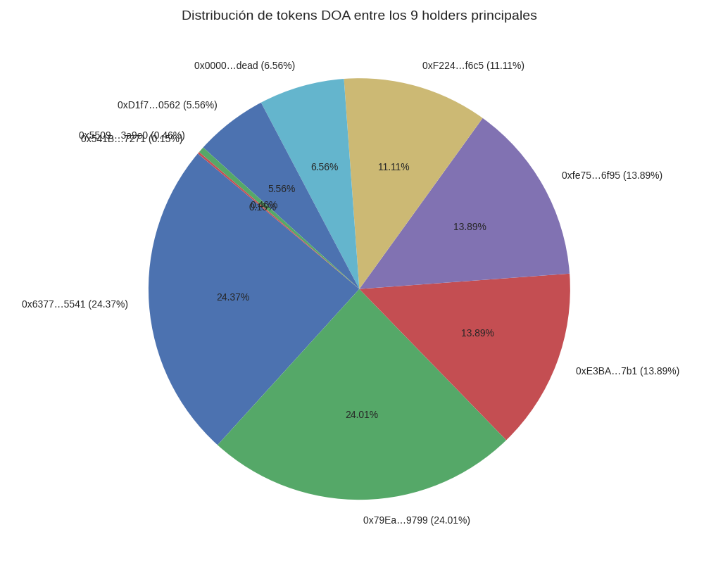

# DOA Token – CEX Application

Este documento contiene la información oficial para solicitar el listado del DOA Token en exchanges centralizados (CEX).

---

## 📋 Información General

- **Token Name:** DOA Token  
- **Symbol:** DOA  
- **Decimals:** 18  
- **Total Supply:** 1,800,000 DOA (ajustado por plan de quema)  
- **Network:** Polygon (chainId 137)  
- **Proxy Address:** 0x692d951163df3f7D9Fe071413F92c319D9B7369E  
- **Implementation Address:** 0xD6426Da6D01233Efe48dab6aD96cf3238f02c305  
- **Owner Address:** 0x6377cd174b35f3630b6d0db695f175d5f0dc5541  
- **Admin Address:** 0xf224bc9a97e0e605c0546f9ced88aaf2228cf6c5  
- **Logo:** https://raw.githubusercontent.com/alimguz-ops/doa-token/main/assets/doa-logo.png  

---

## 📑 Documentación Adjunta

- **Audit Report:** `audit/audit-report.md`  
- **Audit Log:** `audit/audit-log.md`  
- **Legal Certification:** `legal/certification.md`  
- **AML/KYC Policy:** `legal/AML-KYC.md`  
- **Community Metrics:** `docs/community-metrics.md`  
- **Project Overview:** `docs/project-overview.md`  

---

## 🎯 Objetivos del Listado

- Aumentar la liquidez y accesibilidad del DOA Token.  
- Garantizar transparencia y confianza con auditorías y documentación legal.  
- Expandir la comunidad y adopción global.  

---

## ✅ Checklist de Aplicación

- [x] Contrato verificado en PolygonScan.  
- [x] Tokenlist oficial publicado en repositorios DEX.  
- [x] Auditoría externa completada y documentada.  
- [x] Certificación legal de no-valor disponible.  
- [x] Métricas de comunidad consolidadas.  
- [ ] Envío de aplicación a CEX con este documento.  
- [ ] Registro de envío en `listing-log.md`.  

---

## 📌 Notas

- Este documento debe actualizarse con cada aplicación enviada a un CEX.  
- Los enlaces y direcciones deben mantenerse en formato checksum.  
- La transparencia y consistencia son clave para la aceptación del listado.

## 🧾 Auditoría de distribución de DOA

El suministro total de DOA es de **1.800.000 tokens**, completamente distribuido entre 9 direcciones verificables.  
Esta tabla presenta los holders principales, incluyendo wallets operativas, comunitarias y dirección de quema.

| # | Dirección (abreviada)       | Cantidad DOA       | % del total | Tipo de holder         |
|---|-----------------------------|---------------------|-------------|-------------------------|
| 1 | 0x6377…5541                 | 438.725             | 24,37%      | Wallet operativa        |
| 2 | 0x79Ea…9799                 | 432.245             | 24,01%      | Wallet operativa        |
| 3 | 0xE3BA…7b1                  | 250.000             | 13,89%      | Colaborador             |
| 4 | 0xfe75…6f95                 | 250.000             | 13,89%      | Colaborador             |
| 5 | 0xF224…f6c5                 | 200.000             | 11,11%      | Admin DOA               |
| 6 | 0x0000…dEaD (burn)          | 118.000             | 6,56%       | Dirección de quema      |
| 7 | 0xD1f7…0562                 | 100.000             | 5,56%       | Wallet comunidad        |
| 8 | 0x5509…3a9e0                | 8.307               | 0,46%       | Wallet menor            |
| 9 | 0x541B…7271                 | 2.721               | 0,15%       | Wallet menor            |

**Total distribuido:** 1.799.998 DOA  
**Suministro máximo:** 1.800.000 DOA  
**Diferencia:** 2 DOA (posiblemente en fees o rounding)

---

### ✅ Observaciones

- El token DOA está **completamente distribuido**, sin minting pendiente ni reservas ocultas.  
- La dirección de quema (`0x0000…dead`) contiene **118.000 DOA**, lo que refuerza la política de supply controlado.  
- Las wallets operativas y comunitarias están etiquetadas para facilitar la auditoría y transparencia.  
- Este desglose puede incluirse en aplicaciones a exchanges como evidencia de distribución clara y trazable.

