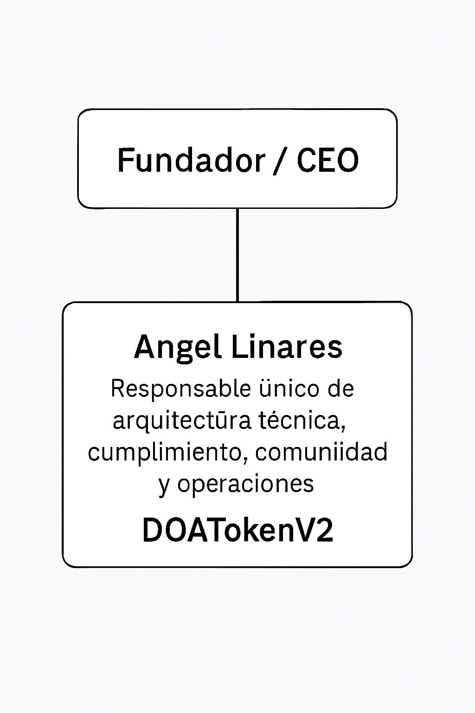

# 🧾 Ficha técnica oficial – DOATokenV2 (DOA)  
# 🧾 Official Technical Sheet – DOATokenV2 (DOA)

---

## 1. Información general / General Information
- **Nombre del token / Token name:** DOATokenV2 (DOA)
- **Tipo / Type:** ERC-20 multichain (Ethereum + Polygon)
- **Contratos verificados / Verified contracts:**
  - [Ethereum – DOATokenV2](https://etherscan.io/address/0x6F52809EfdDF5826956EeF9C289A661624afb0cE)  
  - [Polygon – DOATokenV2](https://polygonscan.com/token/0x692d951163df3f7D9Fe071413F92c319D9B7369E)
- **Suministro máximo / Max supply:** 1,800,000 DOA
- **Holders actuales (Polygon):** 10  
- **Transferencias registradas (Polygon):** 17  
- **Holders actuales (Ethereum):** *pending from Etherscan*  
- **Transferencias registradas (Ethereum):** *pending from Etherscan*

---

## 2. Repositorio operativo / Operational Repository
- **GitHub oficial / Official GitHub:** [alimguz-ops/doa-token](https://github.com/alimguz-ops/doa-token)

---

## 3. Tokenomics
- **Enlace oficial / Official link:** [TOKENOMICS.md](https://github.com/alimguz-ops/doa-token/blob/main/TOKENOMICS.md)
- **Distribución inicial / Initial distribution:**
  - 20% Liquidez inicial / Initial liquidity
  - 30% Tesorería comunitaria / Community treasury
  - 25% Staking y recompensas / Staking & rewards
  - 15% Gobernanza y desarrollo / Governance & development
  - 10% Reserva estratégica / Strategic reserve
- **Precio público inicial / Initial public price:** USD 0.50 per DOA
- **Market Cap inicial (FDV):** USD 900,000

**Direcciones principales / Main addresses:**
- Owner: 1,000,000 DOA – [0x6377cd174b35f3630b6d0db695f175d5f0dc5541](https://polygonscan.com/address/0x6377cd174b35f3630b6d0db695f175d5f0dc5541)  
- Admin: 200,000 DOA – [0xf224bc9a97e0e605c0546f9ced88aaf2228cf6c5](https://polygonscan.com/address/0xf224bc9a97e0e605c0546f9ced88aaf2228cf6c5)  
- Reserva Binance / Binance Reserve: 250,000 DOA – [0xfe7522c992ab5193ba66195ccbef65e3b0b76f95](https://polygonscan.com/address/0xfe7522c992ab5193ba66195ccbef65e3b0b76f95)  
- Comunidad / Community: 100,000 DOA – [0xD1f7a79CE44b267Dfe51B6F84008208550a30562](https://polygonscan.com/address/0xD1f7a79CE44b267Dfe51B6F84008208550a30562)  
- Colaborador / Collaborator: 250,000 DOA – [0xe3baefcbad73d05512deaad182ed0cf8b3a5e7b1](https://polygonscan.com/address/0xe3baefcbad73d05512deaad182ed0cf8b3a5e7b1)  
- Wallet Binance: [0xb27df745fc43ca79f8250e52639594ae96315ef5](https://polygonscan.com/address/0xb27df745fc43ca79f8250e52639594ae96315ef5)  

  

---

## 4. Redes sociales oficiales / Official Social Media
- **Discord:** [https://discord.gg/TCXB69cm](https://discord.gg/TCXB69cm)  
- **Twitter/X:** [https://x.com/DoaV270493](https://x.com/DoaV270493)  
- **Telegram:** [https://t.me/DOAv2](https://t.me/DOAv2)  
- **GitHub:** [https://github.com/alimguz-ops/doa-token](https://github.com/alimguz-ops/doa-token)

---

## 5. Estado del proyecto / Project Status
- **Token lanzado y verificado / Token launched and verified**  
- **Liquidez en QuickSwap y Uniswap / Liquidity in QuickSwap and Uniswap** via QuickLaunch  
- **Scripts automatizados / Automated scripts** for audit, governance, and liquidity  
- **Documentación modular en proceso / Modular documentation in progress:** TOKENOMICS.md, ROADMAP.md, TEAM.md, AUDIT.md  

---

## 6. Fundador / Founder
- **Angel R. Linares** – Fundador único, responsable de arquitectura técnica, cumplimiento, comunidad y operaciones  
- **Angel R. Linares** – Sole founder, responsible for technical architecture, compliance, community, and operations  

  

---

## 7. Próximos pasos / Next Steps
- Finalizar documentación pública / Finalize public documentation  
- Activar liquidez en QuickSwap y Uniswap / Activate liquidity in QuickSwap and Uniswap  
- Completar aplicación QuickLaunch / Complete QuickLaunch application  
- Publicar auditoría externa / Publish external audit  
- Consolidar comunidad y cotización en CEX / Consolidate community and listing on CEX
